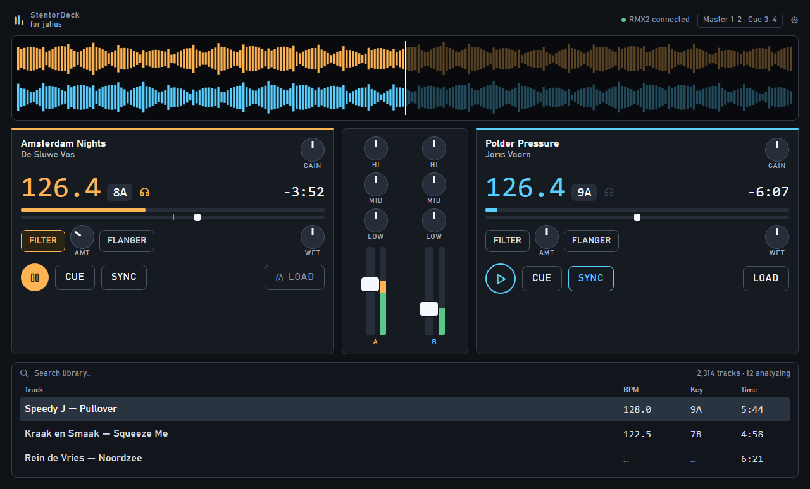
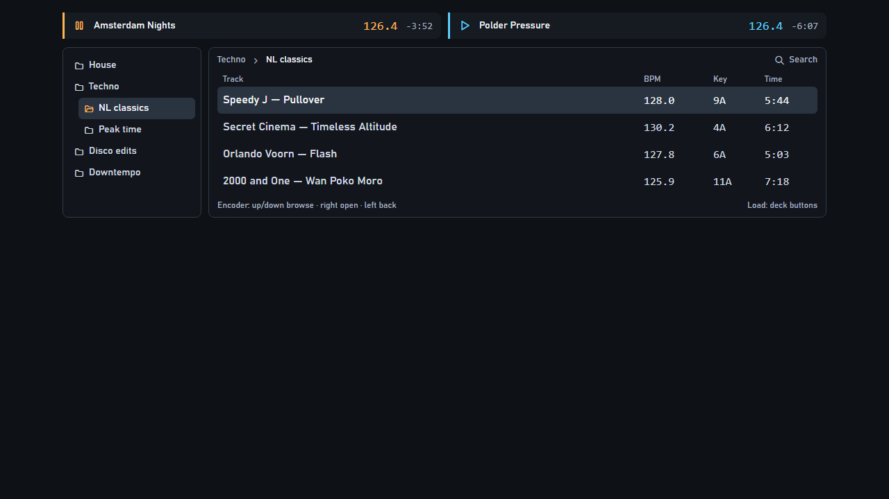
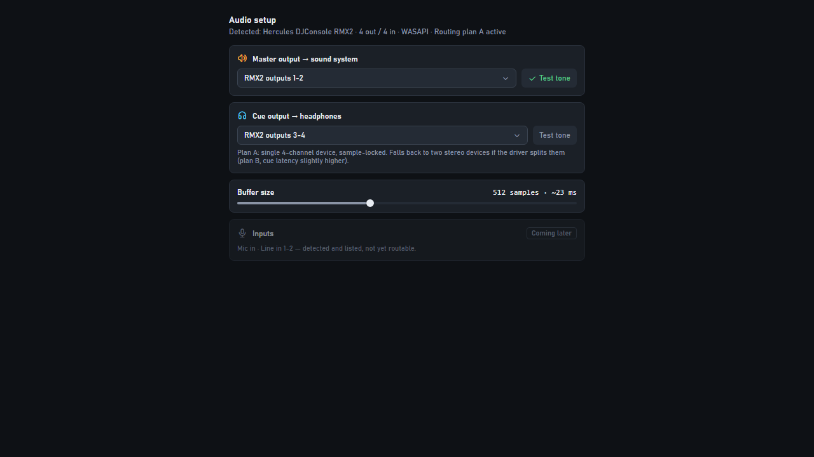
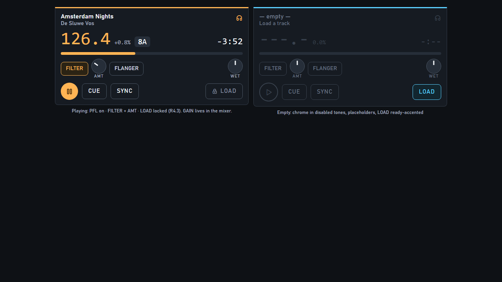
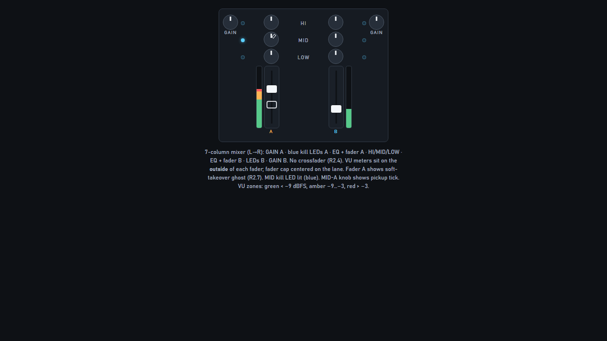
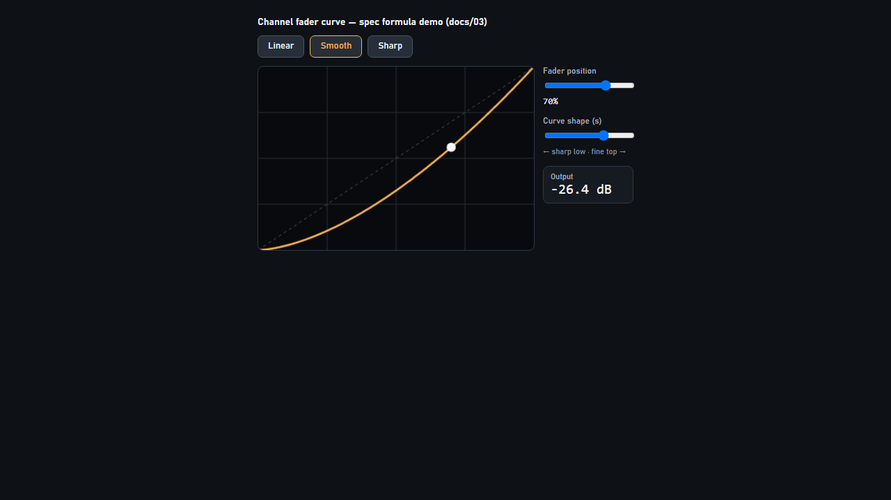

<p align="center">
  
</p>

<p align="center">
  Two-deck DJ application for Windows, built around the Hercules DJConsole RMX2.<br />
  <em>for julius</em>
</p>

**Spec is law:** see [`docs/README.md`](docs/README.md), [`docs/ROADMAP.md`](docs/ROADMAP.md), [`docs/CHANGELOG.md`](docs/CHANGELOG.md).

Brand assets live in [`brand/`](brand/) (mark, wordmark, app icon).

## UI mockups

Authoritative HTML mockups and PNGs — see [`docs/mockups/MOCKUPS.md`](docs/mockups/MOCKUPS.md). Regenerate with `npm run docs:screenshots`.

### Performance



Header MST / CUE / PHN · waveform well · decks with pitch strip & FX · **7-column mixer** (GAIN · kill LEDs · EQ/faders · labels) · library fill.

### Prep



**In-app Help** (topbar **Help** or **F1**) searches the operator guides in [`docs/guides/`](docs/guides/). Prep walkthrough: [`docs/guides/prep-library.md`](docs/guides/prep-library.md).

### Audio setup



### Deck panel states



### Mixer column



### Fader curve editor



## Stack

Electron · React 18 · TypeScript strict · MobX · better-sqlite3 · Web Audio · Web MIDI

## Start the app

### Easiest (Windows)

1. Install [Node.js 22 LTS](https://nodejs.org) once (recommended).
2. Double-click **[`INSTALL.bat`](./INSTALL.bat)** in the repo root.

That script installs dependencies (Electron ABI for `better-sqlite3`), rebuilds the native module, creates a **Desktop shortcut**, and starts the app (packaged `.exe` if present, otherwise source/dev). Same entry: `npm run setup`.

[`Start StentorDeck.bat`](./Start%20StentorDeck.bat) launches a packaged `.exe` if present; otherwise it runs `INSTALL.bat`.

If it fails: close anything locking `node_modules`, delete that folder, run `INSTALL.bat` again. Prefer Node 22 — avoid Cursor’s helper Node on PATH (`where node` must not be under `…\cursor\…\helpers\`).

### Production-style (Explorer icon, no command window)

```bash
npm run dist          # NSIS installer — Desktop + Start Menu shortcuts with brand icon
# or quick unpacked build:
npm run dist:dir
npm run shortcut      # Desktop StentorDeck.lnk → exe (or Launch-StentorDeck.vbs)
```

Windows packaging embeds `build/icon.ico` via an `afterPack` rcedit hook (avoids winCodeSign symlink issues).

Double-click **StentorDeck** on the Desktop. Closing the window shuts down analysis, DB, and MIDI cleanly. Boot shows a short branded splash.

Silent helper: [`scripts/Launch-StentorDeck.vbs`](scripts/Launch-StentorDeck.vbs).

### Development (already installed)

```bash
npm start             # same as npm run dev
```

Dev starts windowed (`STENTOR_WINDOWED=1`). Fullscreen like production: `STENTOR_WINDOWED=0`.

If you see `NODE_MODULE_VERSION` errors: `npm run rebuild:native` (or just re-run `INSTALL.bat`).

**npm deprecation warnings:** Leftover `glob` / `inflight` / `rimraf` / `tar` / `npmlog` / `prebuild-install` noise is from **electron-builder** / native tooling (upstream). `EPERM` on Windows = something locking `node_modules`.

```bash
npm test                 # unit + component (Vitest)
npm run test:coverage
npm run test:e2e         # Playwright end-user (no RMX2)
npm run docs:screenshots # mockup PNGs → docs/mockups/screenshots/
npm run lint
npm run typecheck
npm run build
npm run dist:dir   # unpackaged win build
npm run dist       # NSIS installer → release/
```

See [`docs/TESTING.md`](docs/TESTING.md).

## Workspaces

| Package | Role |
|---|---|
| `shared` | IPC contract, settings zod, MIDI/audio pure logic, analysis contract |
| `app/main` | Electron main, SQLite, scanner/watcher, analysis supervisor, IPC, splash |
| `app/renderer` | React/MobX UI + audio/MIDI engines + Prep browser |
| `app/analysis` | Hidden BrowserWindow — decode / waveform / BPM / key / loudness (E5) |

## Roadmap & status

Living tracker (mirrors [`docs/ROADMAP.md`](docs/ROADMAP.md)). Decision detail: [`docs/CHANGELOG.md`](docs/CHANGELOG.md).

**Legend:** `DONE` · `DOING` · `TODO` · `BACKLOG`

### Build order

```
E1 skeleton → E2 audio [HW ✓] → E3 MIDI [HW ✓]
                → E4 library  ⎤
                → E5 analysis ⎦ parallel
                → E6 UI [HW mix]
                → E7 polish
```

| Epic | Status | When | What landed / what’s left |
|---|---|---|---|
| **E1** Skeleton | DONE | 2026-07-18 | Shell, typed IPC, settings, SQLite, workspaces |
| **E2** Audio engine | DONE | 2026-07-18 | Dual-deck engine, Plan A/B, cue/PFL, USB rebuild. **`[HW]` PASS**. Checklist: [`docs/E2-HW-CHECKLIST.md`](docs/E2-HW-CHECKLIST.md) |
| **E3** MIDI layer | DONE | 2026-07-18 | Decode/map/dispatch/learn/persist/takeover/LEDs. **`[HW]` PASS**. Checklist: [`docs/E3-HW-CHECKLIST.md`](docs/E3-HW-CHECKLIST.md) |
| **E4** Library | DOING | 2026-07-18 | Scan/watcher, Prep + Perf browse, roots. Left: large-library soak ACs |
| **E5** Analysis | DOING | 2026-07-18 | Pipeline + idle backfill + **beatgrid (v3)** for SYNC. Left: accuracy harness |
| **E6** Decks/mixer UI | DOING | 2026-07-18 | Perf v2: 7-col mixer, dual-zone jog (settings), load reconcile, MST default 30%. Left: curve editor UI, `[HW]` mix |
| **E7** Polish | DOING | 2026-07-18 | Splash + graceful quit + NSIS Desktop/Start shortcuts started. Left: soak, failure drills, MANUAL |

### Same-day milestones (2026-07-18)

| Time context | Milestone |
|---|---|
| Spec lock | Requirements + docs/01–07; Sync stays SYNC; library sort/duplicates |
| E1–E3 | Shell → audio `[HW]` → MIDI `[HW]` |
| E4–E5 | Library + analysis pipeline + beatgrid SYNC |
| E6 Perf v2 | Header outs, deck chrome, 7-col mixer, blue kill LEDs |
| Jog feel | Dual-zone SL-1200 / spinback; live Settings sliders + presets |
| Load / takeover | Pitch/EQ stay live on load; filter/wet adopt hardware; gain after auto-gain |
| Booth safety | MST default **30%**; safety limiter threshold −3 dB |
| Packaging start | Branded splash, clean shutdown, `npm run dist` / `shortcut` |

### In progress right now

- **E4** — large-library soak against E4 ACs.
- **E5** — Accuracy harness + confidence tuning.
- **E6** — `[HW]` full manual mix; pitch dead-zone viz; fader-curve settings surface.
- **E7** — Installer polish, soak, failure drills, MANUAL.

### Next up

- Owner `[HW]` mix pass on RMX2; finish E7 packaging / drills.

### Parked (not v1)

v2 Spotify + AI mixmatch — [`docs/BACKLOG-v2-spotify-ai.md`](docs/BACKLOG-v2-spotify-ai.md) (locked 2026-07-18).
