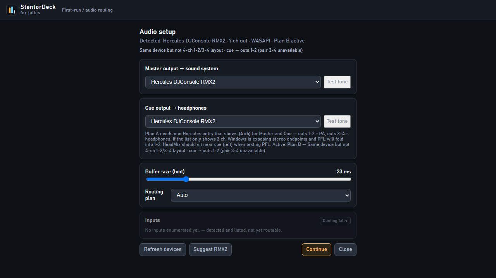

# Audio & volume

For DJs. Get sound to the booth and to your headphones without drama.

## Pick your outputs

Open **Audio** in the top bar.

| Setup | Meaning |
|-------|---------|
| **Best (Plan A)** | One box with 4 channels (typical RMX2): outs **1–2** = booth, **3–4** = headphones |
| **Simple (Plan B)** | Separate device for booth and for headphones, or one stereo device for both |

The top bar shows which plan is active. Prefer a **named** device, not “Default”, when you can.

## Loudness — four steps

1. **GAIN** — match song loudness  
2. **EQ** — cut more than you boost  
3. **Channel fader** — blend into the mix  
4. **MST** — booth level (starts around **30%**)

If the room is too loud, turn **MST** down first — don’t bury everything in EQ kills.

## Headphones

- Tap the headphone icon on a deck (**PFL**) to hear that deck in your cans.  
- With PFL on, the VU still shows level even if the channel fader is down — match volumes before you open the fader.  
- **Red / peaking** on the VU = too hot. Ease GAIN or the fader.  
- **CUE** (top bar) — blend “cue only” vs “a bit of the master” in your headphones.  
- **PHN** — software headphone loudness.  
  The RMX2’s physical phones knob is **analog** (not MIDI). Use on-screen **PHN**, or Learn a spare knob.

## Spec links

Operator guide ends here. Routing plans: [`../02-architecture.md`](../02-architecture.md), [`../03-audio-engine.md`](../03-audio-engine.md).
