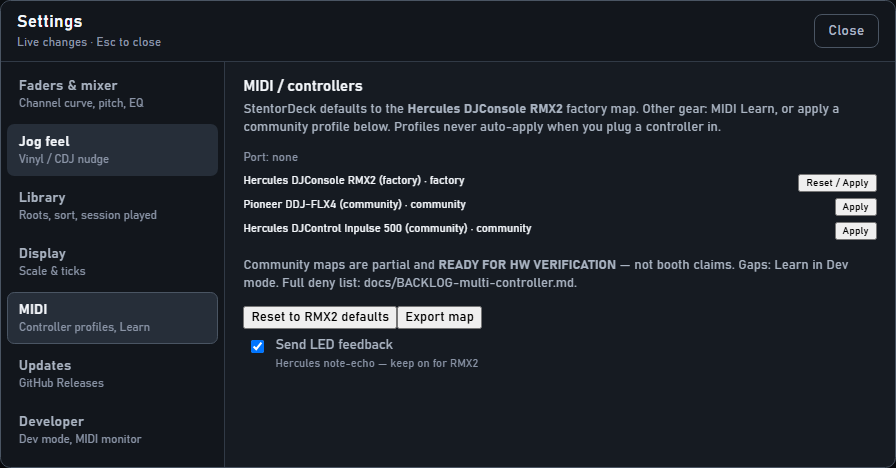

# Controllers & MIDI — for DJs

This page is for **you in the booth**. No hex codes. No “CC14”. Just what to plug in and how to mix.

---

## The short version

1. **Hercules DJConsole RMX2** — plug in USB. It just works.  
2. **Another MIDI controller** — plug in → Settings → **MIDI** → Learn (or pick a community profile) → play.  
3. **No controller** — mouse and keyboard still work.

StentorDeck was **born on the RMX2**. Other gear is welcome; you may need a few minutes of Learn.

---

## Hercules RMX2 (recommended)

1. Plug the RMX2 into USB.  
2. Look at the top bar — it should say MIDI is connected.  
3. Use the decks like a normal mixer: play, cue, sync, load, EQ, faders, jog wheels.

### What the main buttons do

| On the RMX2 | What it does |
|-------------|--------------|
| **Play** | Start / pause that deck |
| **Cue** | Jump to cue / classic cue behaviour |
| **Sync** | Match tempo to the other deck (help, not autopilot) |
| **Load** | Load the selected track onto that deck (deck must be **paused**) |
| **Headphones** | Listen to that deck in your cans (PFL) |
| **EQ kills** | Mute high / mid / low on that deck |
| **Jog wheel** | Nudge the beat (or scrub when paused) |
| **Vinyl** button | Changes jog feel (ride vs spinny) — try both |

Browse knobs / arrows move through your **library folders and tracks** — same list as on screen.

### Volume knobs on the top of the app

| On screen | Meaning |
|-----------|---------|
| **MST** | Booth / PA loudness (starts low on purpose — about 30%) |
| **CUE** | Mix of “cue only” vs “hear the master in headphones” |
| **PHN** | How loud the software cue bus is |

The **physical** headphones volume knob on the RMX2 is analog — it does **not** move the on-screen PHN. Use **PHN** on screen, or Learn a spare knob if you want MIDI for that.

### Pads (filter & flanger)

Put the pads in **FX mode** on the RMX2:

- Pad **1** — filter on/off  
- Pad **2** — flanger on/off  
- The FX encoder next to them — amount (and wet when flanger is on)

---

## Other controllers (Pioneer, Inpulse, …)

You have two options.

### Option A — community profile (quick start)

1. Open **Settings → MIDI**.  
2. Pick a profile (for example **Pioneer DDJ-FLX4** or **Hercules Inpulse 500**).  
3. Read the warning → **Apply**.  
4. Try play / cue / faders.  
5. Anything missing → use **Learn** (Option B).

Profiles are **partial** — not every button is mapped. That is normal.  
**Reset to RMX2 defaults** always brings back the factory Hercules map.

LED lights on non-RMX2 gear often stay off. That is OK for mixing.

### Option B — MIDI Learn (map your own)

1. Open **Settings → MIDI**.  
2. Turn **Learn** on.  
3. Click the control on screen you want (e.g. Play on deck A).  
4. Move or press the matching control on your hardware.  
5. Confirm. Repeat for the next control.  
6. Turn Learn off when done.

**Tips**

- Map the stuff you use every set first: play, cue, sync, load, faders, EQ, pitch, jog.  
- If a knob “does nothing” after you moved the mouse — see **Knobs & soft takeover** in Help.  
- Never panic: **Reset to RMX2 defaults** undoes a messy map.

Profiles and Learn **never** auto-switch when you plug something in. You choose.

---

## Soft takeover (why a fader “won’t move”)

Sometimes the screen value and the physical fader disagree (after load, or after clicking the UI).

A hollow mark means: **move the hardware until it crosses the screen value**. Then it locks on and you’re live again. That protects the PA from sudden jumps.

Full story: Help → **Knobs & soft takeover**.

---

## Quick FAQ

**Nothing happens when I press buttons**  
Is MIDI connected in the top bar? Try unplug / replug USB. On Windows, close other DJ software that might grab the device.

**Can I use two controllers at once?**  
One MIDI map at a time. Pick RMX2 defaults or one profile / your Learn map.

**Will Learn wipe my library?**  
No. Only the button/knob map changes.

**I want the nerdy note numbers**  
That’s for developers — see the MIDI map reference on the website under **For developers**, or `docs/04-midi-map.md` in the repo.

---

## Spec links

Operator guide ends here.

- Factory note/CC tables (engineers): [`../04-midi-map.md`](../04-midi-map.md)  
- Multi-controller backlog: [`../BACKLOG-multi-controller.md`](../BACKLOG-multi-controller.md)  
