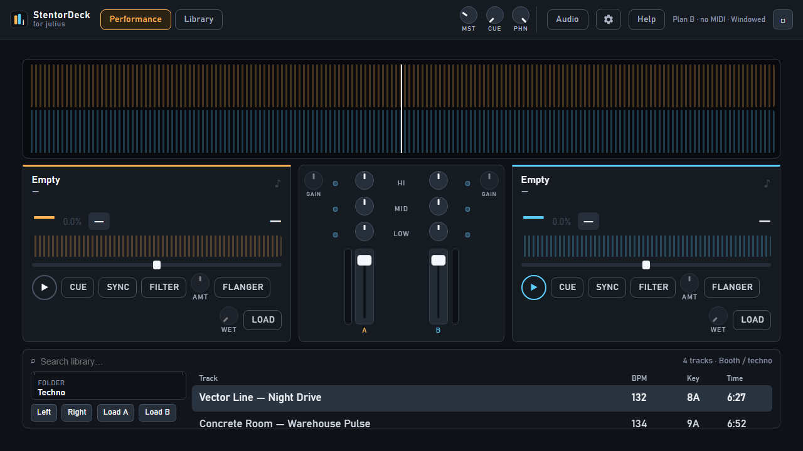

# Getting started

Welcome to **StentorDeck** — two decks for mixing, built around the **Hercules DJConsole RMX2**.

This guide is for **DJs**. Keep it simple.

## The two screens

| Button | Use it for |
|--------|------------|
| **Performance** | Live mixing — waveforms, mixer, play / cue / sync |
| **Library** | Find tracks, fix BPM & key, load decks |

## First boot — do this once

1. Click **Audio** (top bar). Pick your sound device for the booth (**master**) and for headphones (**cue**).  
   - Ideal: RMX2 with 4 outputs — booth on 1–2, headphones on 3–4.  
   - Otherwise: pick two devices, or the best stereo outs you have.
2. **Settings → Library → Browse…** — choose the folder with your music → **Rescan**.
3. Plug in the RMX2 (or your MIDI controller). Top bar should show MIDI connected.
4. Open **Library**, load a track to deck **A** (leave it paused), switch to **Performance**, press **Play**.

## Master volume (important)

**MST** starts low (about **30%**) so a cold start does not blast the PA.  
Turn the channel faders up first. Raise **MST** only when the mix sounds healthy.

There is a safety limiter after MST — it catches accidents. It is **not** a “make everything louder” button.

## Where is Help?

Top bar → **Help**, or press **F1**. Search for words like sync, load, MIDI, update.

## Next

- Controllers: Help → **Controllers & MIDI**  
- Library tips: Help → **Library mode**  
- Updates: Help → **Updating the app**

## On a Mac?

There is **no** Mac installer. The supported booth app is **Windows**.  
If you want to experiment from source anyway (unsupported):  
[`run-from-source-macos.md`](./run-from-source-macos.md) — also on the website under **Other platforms**.

## Spec links

Operator guide ends here. Engineers: [`../01-requirements.md`](../01-requirements.md), [`../02-architecture.md`](../02-architecture.md).
