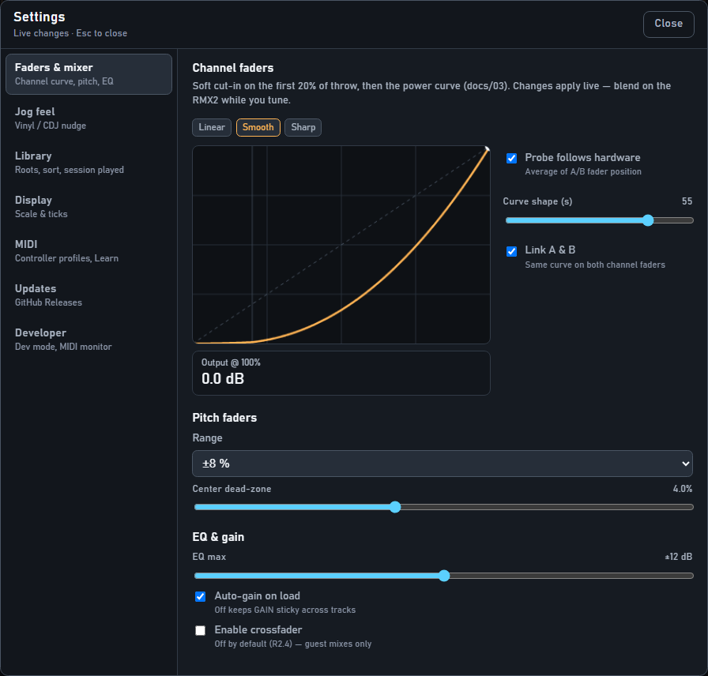

# Knobs, faders & soft takeover

For DJs. Why a knob sometimes “does nothing” — and how to wake it up.

## The problem

The screen and the physical knob can disagree — for example after you clicked the UI, or after loading a track.

If the software jumped straight to the knob position, the PA could **blast** or drop out. So StentorDeck waits.

## Soft takeover (the fix)

1. You see a hollow **pickup** mark on the control = where the hardware is.  
2. The filled part = where the software is.  
3. Move the hardware **through** the software value (or right onto it).  
4. Mark disappears → you’re live again.

That’s it. Cross the value once; don’t fight it.

## After loading a track

- **Pitch & EQ** usually stay live if they already were.  
- **Filter / wet** follow the last hardware position (FX pads still turn off on load).  
- **Gain** only needs a quick pickup when auto-gain changed the trim. With auto-gain off, GAIN stays put.

You should **not** have to re-match every knob on every load.

## Spec links

Operator guide ends here. Curve math: [`../03-audio-engine.md`](../03-audio-engine.md).
