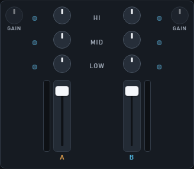

# Performance & mixer

How the live mixing screen is laid out. For DJs.

## Top to bottom

1. **Top bar** — Performance / Library, **MST · CUE · PHN**, Audio, Help, Settings  
2. **Waveforms** — both decks scrolling  
3. **Deck A · Mixer · Deck B**  
4. **Library strip** — same music list as Library mode (smaller)

## Mixer (middle)

Left → right:

**GAIN A · kill lights A · EQ + fader A · HI/MID/LOW · EQ + fader B · kill lights B · GAIN B**

| Control | What it does |
|---------|----------------|
| **GAIN** | How loud this track is going into the mix |
| **HI / MID / LOW** | Tone knobs |
| **Blue kill lights** | Click to mute that band |
| **Faders** | Channel volume (VU meters sit outside each fader) |

There is **no crossfader** in this version. Mix with the two channel faders.

## Each deck

- Title / artist, headphone button (**PFL**)  
- Big **BPM**, pitch %, key, time left  
- Waveform + pitch strip  
- Buttons: **Play · CUE · SYNC · FILTER · AMT · FLANGER · WET · LOAD**

**FILTER** and **FLANGER** are on/off. **AMT** and **WET** set how much.

## Loading while playing

You **cannot** load into a deck that is already playing. Pause first.  
If you try, LOAD looks locked and a short message appears.

## Spec links

Operator guide ends here. Layout tokens: [`../06-ui-style-guide.md`](../06-ui-style-guide.md).
