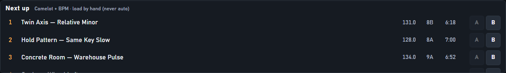

# Library mode

This page is for **you**, the DJ — not for programmers.

## What is Library?

StentorDeck has two big screens:

| Button | What it’s for |
|--------|----------------|
| **Performance** | Mixing live: waveforms, faders, play / cue / sync |
| **Library** | Getting music ready: find tracks, fix BPM & key, load decks |

Think of it like this:

- **Library** = the back room where you sort records  
- **Performance** = the booth where you play them  

Your folders on disk are the crates. The app does **not** invent playlists.

---

## What is “the library”?

A **list of your songs** the app has looked at on your computer.

When you pick a music folder, StentorDeck:

1. Looks through that folder (and folders inside it)  
2. Remembers each song (title, artist, length, BPM, key when known)  
3. Shows them so you can browse and load  

Works with **MP3**, **FLAC**, **WAV**.

The app **never moves or renames** files on disk, and **never deletes your original** music. Exception: you may delete **StentorDeck sibling WAVs** named `(Fixed by SD)` or `(Normalized by SD)` (one file or purge many). Title/artist in the list can be edited in the app — that does **not** rename the file.

---

## First time: add your music folder

1. Open **Settings** (or follow “Choose a music folder…”).  
2. Click **Browse…** and pick the folder with your DJ tracks.  
3. Wait for **Rescan** — the list fills in.  

Add more folders later and press **Rescan** if something new does not show up.

---

## The Library screen

### Top — Deck A and Deck B strips

What’s loaded on each deck (name, BPM, time, playing or not) while you dig through folders.

### Left — folders

- Click a folder → its tracks appear on the right.  
- Expand / collapse with the arrows.  
- Your real folders on disk = your crates.

### Right — song list

| Column | Meaning |
|--------|---------|
| **Track** | Artist and title (or file name) |
| **BPM** | How fast the song is |
| **Key** | Musical key as Camelot (`8A`, `9B`, …) |
| **Time** | Length |

- **`…`** = not known yet (often still analyzing)  
- **`≈`** before BPM = we’re not sure — check with Tap / Detect if Sync feels wrong  
- Faint **`~`** by the key = might mix nicely with what’s playing / loaded (hint only)  
- Dim row with **`✓`** = you already played it this session  

### Search

Type an artist or title. Searches the **whole** library. Clear search to go back to folders.

### Bottom — correction panel

Select a **track**. The bottom panel has two zones: **track & tempo** (always), then **Fix** or **Loudness** (one at a time).

**Always visible**

| Control | What it does |
|---------|----------------|
| **Title** / **Artist** | How the track shows in the list (library DB only; file name unchanged) |
| **BPM** | Type the number, press Enter |
| **Tap** / **Apply** | Tap the beat (≥4), then apply |
| **½** / **×2** | Fix half/double tempo mistakes |
| **Detect** | Re-analyze (BPM, key, beatgrid, waveform, loudness) |
| **Camelot** | Set key yourself, or clear with `—` |

**Fix** tab (click & squeak)

| Control | What it does |
|---------|----------------|
| **Preset** | Gentle / Normal / Aggressive |
| **Tune** | Opens Fade / Trim / De-click (same settings for Preview and Write) |
| **Preview** | **Phones only** — while playing, use the **PHONES** bar: Original / Fixed / A/B / Stop |
| **Write** / **Rewrite** | New or overwrite `… (Fixed by SD).wav` — original never touched |
| **Check** / **Delete** / **Purge…** | Quiet actions on the right (truncate check; remove SD siblings only) |

**Loudness** tab

| Control | What it does |
|---------|----------------|
| **Preview** | **Phones only** — Original / Normalized A/B (needs Detect first) |
| **Write** / **Rewrite** | New or overwrite `… (Normalized by SD).wav` |

**Right-click** a track → **Click & squeak fixer…** selects it, opens Library on the **Fix** tab (Tune expanded), and runs Check for MP3s. Same menu still has Check / Preview / Write / Rewrite / Delete / Load A·B.

Fixes are remembered next time.

---

## Load a song onto a deck

1. Click a track so it’s highlighted.  
2. Load it:

| How | Goes to |
|-----|---------|
| **Double-click** | Deck **A** |
| **Enter** | Deck **A** |
| **Drag** a track onto a **waveform** (Performance) or **deck strip** (Library) | That deck |
| RMX2 **Load** A or B | That deck |
| In **Performance**: **Load A** / **Load B** | That deck |

### Cue without a jog (mouse)

In **Performance**, on a loaded deck’s waveform (big strip or overview under the deck):

- **Drag** or **click** to move the playhead  
- **Double-click** while paused to set the **cue** there (same as Cue when the playhead isn’t already on cue)

### Rules (so nothing explodes mid-set)

- You **cannot** load into a deck that is **already playing**. Pause first.  
- You **cannot** load a folder — only a track.  
- Loading a new track **resets** that deck (FX, filter, sync, cue) — clean start every time.

---

## Keyboard & Hercules

Mouse, keyboard, and the RMX2 all move the **same** highlight.

- ↑ / ↓ — move in the focused pane (folders or tracks)  
- → — open a folder, or jump focus to the track list  
- ← — back to folders / parent folder  
- Enter — load selected track to **A**  
- Load A / Load B on the RMX2 — load to that deck  

---

## A simple prep workflow

1. Open **Library**.  
2. Open tonight’s folder (or search).  
3. Check **BPM** and **Key**. Fix weird ones.  
4. Load song into **A** (paused). Cue it.  
5. Find the next track.  
6. Switch to **Performance** when you’re ready to mix.  
7. Use the small library strip there to load **B** while A plays.

---

## Harmonic neighbours first

**Settings → Library → Harmonic neighbours first** (off by default).

When a deck is **playing**, the track list puts Camelot fits at the top:

1. Same key, ±1, or relative (A↔B)  
2. Then ±2 on the wheel  
3. Then everything else  

Your normal Sort (filename, BPM, …) still applies **inside** each group.  
If nothing is playing, the list is unchanged.

## Next up (mixmatch)

**Settings → Library → Next up** = **Rules** shows a strip of 5–10 suggested tracks (Camelot + BPM vs the playing deck). You still load by hand — A / B buttons. Off by default. No cloud.

## Quick FAQ

**Why is BPM empty or `…`?**  
Still analyzing, or no tag yet. Select the track → **Detect**, or wait.

**Why does Sync sound wrong?**  
Often half/double BPM — try **½** / **×2** / **Tap**. Or no beatgrid — **Detect**, reload, SYNC again.

**What does Camelot mean?**  
A DJ-friendly code for musical key. Nearby numbers usually mix nicer. The `~` mark is a hint, not a rule.

**Can I make playlists inside the app?**  
Not in this version. Use folders on your disk.

**Does Library delete files?**  
Never your originals. You may delete **Fixed by SD** / **Normalized by SD** sibling WAVs (or purge them in a folder).

---

## Spec links

Operator guide ends here. Technical detail: R5.* / R4.2 in [`../01-requirements.md`](../01-requirements.md), scanner [`../05-library-and-analysis.md`](../05-library-and-analysis.md).
