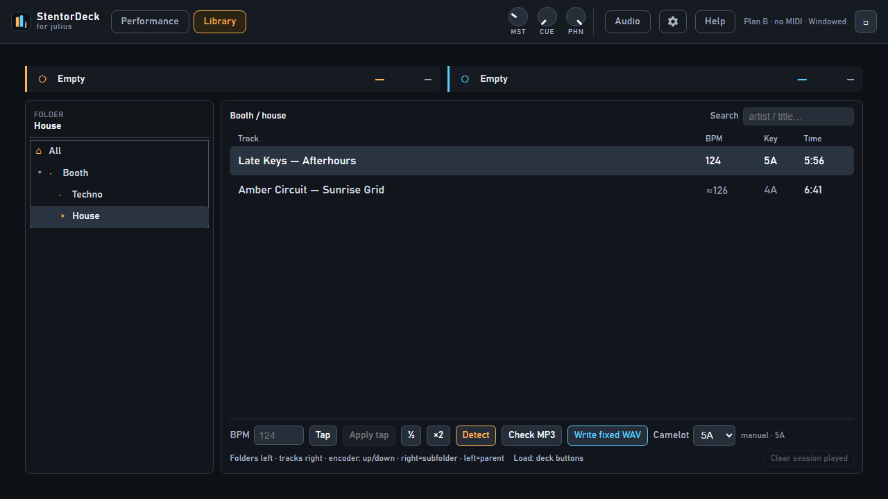

# Library mode

This page is for **you**, the DJ — not for programmers.

## What is Library?

StentorDeck has two big screens:

| Button | What it’s for |
|--------|----------------|
| **Performance** | Mixing live: waveforms, faders, play / cue / sync |
| **Library** | Getting music ready: find tracks, fix BPM & key, load decks |

Think of it like this:

- **Library** = the back room where you sort records  
- **Performance** = the booth where you play them  

Your folders on disk are the crates. The app does **not** invent playlists.

---

## What is “the library”?

A **list of your songs** the app has looked at on your computer.

When you pick a music folder, StentorDeck:

1. Looks through that folder (and folders inside it)  
2. Remembers each song (title, artist, length, BPM, key when known)  
3. Shows them so you can browse and load  

Works with **MP3**, **FLAC**, **WAV**.

The app **never moves, renames, or deletes** your music files. It only reads them.

---

## First time: add your music folder

1. Open **Settings** (or follow “Choose a music folder…”).  
2. Click **Browse…** and pick the folder with your DJ tracks.  
3. Wait for **Rescan** — the list fills in.  

Add more folders later and press **Rescan** if something new does not show up.

---

## The Library screen

### Top — Deck A and Deck B strips

What’s loaded on each deck (name, BPM, time, playing or not) while you dig through folders.

### Left — folders

- Click a folder → its tracks appear on the right.  
- Expand / collapse with the arrows.  
- Your real folders on disk = your crates.

### Right — song list

| Column | Meaning |
|--------|---------|
| **Track** | Artist and title (or file name) |
| **BPM** | How fast the song is |
| **Key** | Musical key as Camelot (`8A`, `9B`, …) |
| **Time** | Length |

- **`…`** = not known yet (often still analyzing)  
- **`≈`** before BPM = we’re not sure — check with Tap / Detect if Sync feels wrong  
- Faint **`~`** by the key = might mix nicely with what’s playing / loaded (hint only)  
- Dim row with **`✓`** = you already played it this session  

### Search

Type an artist or title. Searches the **whole** library. Clear search to go back to folders.

### Bottom — fix BPM and key

Select a **track**, then:

| Control | What it does |
|---------|----------------|
| **BPM** box | Type the number, press Enter |
| **Tap** | Tap the beat (at least 4 taps), then **Apply tap** |
| **½** / **×2** | Fix half/double tempo mistakes |
| **Detect** | Re-analyze that song (BPM, key, beatgrid, waveform). Need this if Sync says “no beatgrid” |
| **Check MP3** | See if a damaged MP3 plays short |
| **Write fixed WAV** | Makes a **new** fixed file next to it. Original MP3 is never changed |
| **Camelot** | Set the key yourself, or clear with `—` |

Fixes are remembered next time.

---

## Load a song onto a deck

1. Click a track so it’s highlighted.  
2. Load it:

| How | Goes to |
|-----|---------|
| **Double-click** | Deck **A** |
| **Enter** | Deck **A** |
| RMX2 **Load** A or B | That deck |
| In **Performance**: **Load A** / **Load B** | That deck |

### Rules (so nothing explodes mid-set)

- You **cannot** load into a deck that is **already playing**. Pause first.  
- You **cannot** load a folder — only a track.  
- Loading a new track **resets** that deck (FX, filter, sync, cue) — clean start every time.

---

## Keyboard & Hercules

Mouse, keyboard, and the RMX2 all move the **same** highlight.

- ↑ / ↓ — move in the focused pane (folders or tracks)  
- → — open a folder, or jump focus to the track list  
- ← — back to folders / parent folder  
- Enter — load selected track to **A**  
- Load A / Load B on the RMX2 — load to that deck  

---

## A simple prep workflow

1. Open **Library**.  
2. Open tonight’s folder (or search).  
3. Check **BPM** and **Key**. Fix weird ones.  
4. Load song into **A** (paused). Cue it.  
5. Find the next track.  
6. Switch to **Performance** when you’re ready to mix.  
7. Use the small library strip there to load **B** while A plays.

---

## Quick FAQ

**Why is BPM empty or `…`?**  
Still analyzing, or no tag yet. Select the track → **Detect**, or wait.

**Why does Sync sound wrong?**  
Often half/double BPM — try **½** / **×2** / **Tap**. Or no beatgrid — **Detect**, reload, SYNC again.

**What does Camelot mean?**  
A DJ-friendly code for musical key. Nearby numbers usually mix nicer. The `~` mark is a hint, not a rule.

**Can I make playlists inside the app?**  
Not in this version. Use folders on your disk.

**Does Library delete files?**  
No. Never.

---

## Spec links

Operator guide ends here. Technical detail: R5.* / R4.2 in [`../01-requirements.md`](../01-requirements.md), scanner [`../05-library-and-analysis.md`](../05-library-and-analysis.md).
