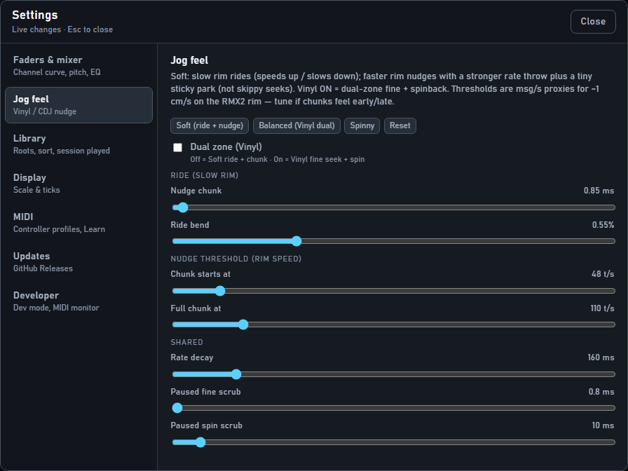

# SYNC & jog wheels

For DJs. Manual beatmatching first — SYNC helps, it does not replace your ears.

## SYNC

1. Press **SYNC** on the deck that should **follow** (the other deck is the master).  
2. Tempo follows the master’s pitch fader.  
3. Beats snap into place, then soft help while SYNC stays lit.  
4. Press SYNC again to turn it off — your phase offset **stays** so the mix does not jump.

### If SYNC sounds wrong

- BPM might be half or double → in **Library**, select the track → try **½** / **×2** / **Tap**.  
- Track needs a beatgrid → select track → **Detect**, wait, **reload** the deck, then SYNC again.  
- Both tracks need a good BPM / grid before SYNC is happy.

### Loading a new track on the master

If the other deck is SYNC’d to you and you load a **new** track on your deck, SYNC turns off on the follower so its pitch does not jump mid-play. Press SYNC again when you want to match the new track.

## Jog wheels (RMX2)

| How you turn | Feel |
|--------------|------|
| **Slow** | Gentle ride — nudge the beat forward or back |
| **Faster push / flick** | Stronger nudge |
| **Paused** | Scrub through the track |

When you stop turning, tempo goes back to the pitch fader. The phase offset you made **stays**.

**Vinyl** button on the RMX2: more “spinny” feel (including a hard whip / spinback). Try Soft vs Vinyl and pick what your hands like.

Want more or less aggressive jogs? **Settings → Jog feel** — presets **Soft · Balanced · Spinny**.

## Spec links

Operator guide ends here. Engine detail: [`../03-audio-engine.md`](../03-audio-engine.md), MIDI: [`../04-midi-map.md`](../04-midi-map.md).
