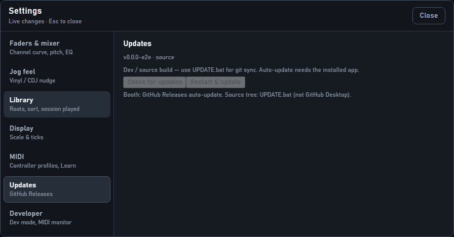

# Updating StentorDeck

Two paths — pick the one that matches how you run the app.

## Installed app (booth / Desktop shortcut → `.exe`)

This is the real product path (R1.1 / E7).



1. On a build machine: follow the release checklist in [`../DEVELOPMENT.md`](../DEVELOPMENT.md) — bump `version` in `package.json`, then:

   ```bash
   npm run release
   ```

   Needs a GitHub token with `repo` scope (`GH_TOKEN` or `GITHUB_TOKEN`). Publishes a **full** GitHub Release (tag `v*`, not Pre-release) with `StentorDeck-Setup-*.exe`, `StentorDeck-ReleaseNotes-*.txt`, **and** `latest.yml`. Uploading only the Setup.exe (or marking Pre-release without `latest.yml`) makes Settings → Check for updates report no feed.

2. On the booth laptop (installed app):
   - Open **Settings → Updates → Check for updates**, or wait a few seconds after launch.
   - When download finishes: **Restart & update** (won’t force while a deck is playing without confirm).
   - Library, analysis, MIDI mapping, and settings stay in `%APPDATA%` (userData).

**Fallback:** copy/run a new `StentorDeck-Setup-*.exe` over the previous install (same upgrade-in-place).

**SmartScreen (unsigned builds):** if Windows shows **“Windows protected your PC”**, click **More info** → **Run anyway**. Browser download block: Keep → Show more → Keep anyway. Do not disable SmartScreen. Auto-update still works (`verifyUpdateCodeSignature: false`). See also README.

## Source tree (`npm start` / INSTALL.bat)

Do **not** use GitHub Desktop as the daily update tool (dirty local files block pulls).

```bat
UPDATE.bat
```

Or: `npm run update`  
If you have uncommitted edits: commit them, or `UPDATE.bat --stash`.

Then launch with **Start StentorDeck.bat** or the Desktop shortcut.

## What not to do

- Pulling `main` over uncommitted agent edits and expecting the installed `.exe` to change — it won’t. The installed app only updates via Releases / Setup.exe.
- Deleting `%APPDATA%\stentordeck` (or similar) to “fix” an update — that wipes the library.
